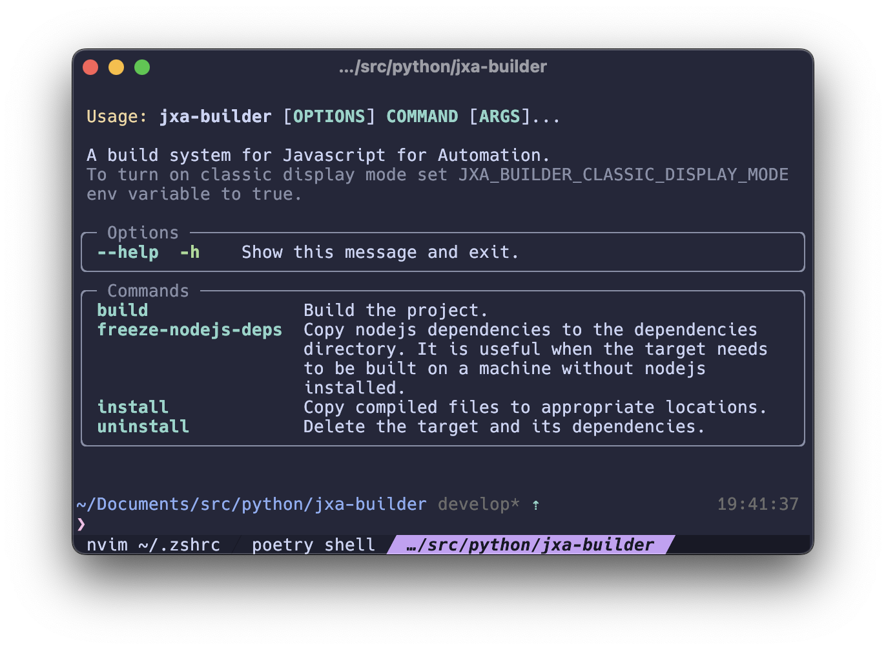
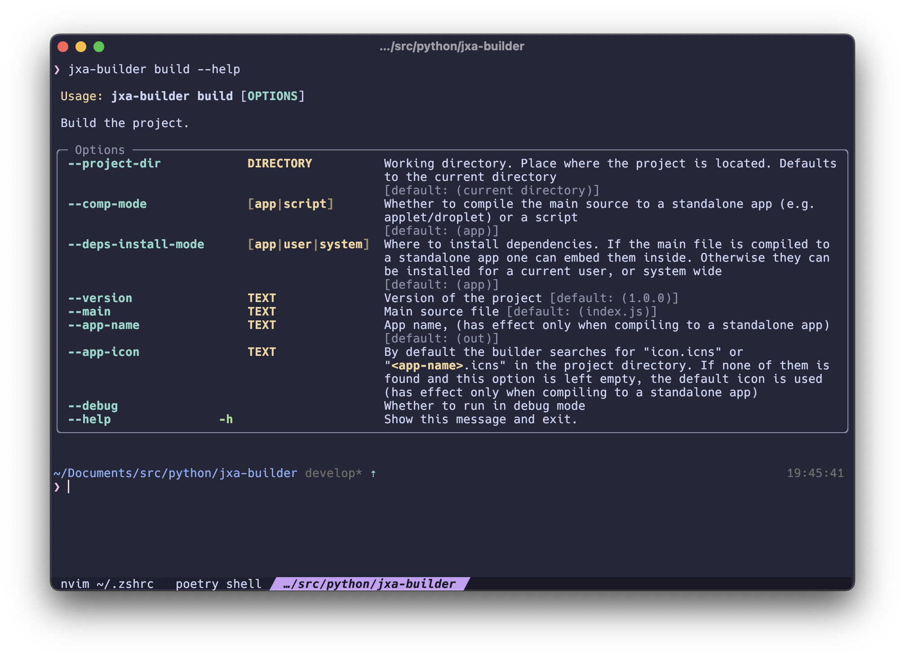

## jxa-builder

JavaScript for automation (JXA) builder with automatic dependencies resolution.
At the moment you can build a standalone applets and reusable libraries.

**Note**: JXA is Apple's technology, so you can use it only on macOS.




### Features

- Easy splitting of your script into modules
- Automatic module dependencies resolution
- Installation/Uninstallation to/from known locations (~/Library/Scripts, /Library/Scripts, /Applications)
- ability to set custom icon for the applet

### Installation

Python 3.8+ is required.
Python3 is already installed on macOS, so no need to install it.

```bash
pip install jxa-builder
## or if you want some isolation
pipx install jxa-builder
```

### Usage

**Project configuration**
Most of the build options can be specified in different ways
The priority from lowest to highest is:

- package.json _(if you use a package manager)_
- jxa.json
- command line arguments

The naming difference between options in command line and json files is that in json files they are camelCase.

So these json config options:

```json
{
  "compMode": "app",
  "depsInstallMode": "system",
  "version": "2.0.0"
  "main": "src/index.js",
  "appIcon": "Neovim.icns",
  "appName": "Neovim",
}
```

are equivalent to these command line options:

```bash
--comp-mode app \
--deps-install-mode system \
--version 2.0.0 \
--main src/index.js \
--app-icon Neovim.icns \
--app-name "Neovim Launcher"
```

**To build and install**

```bash
cd /path/to/your/project
jxa-builder build
jxa-builder install
```

```bash
## You can also specify locations explicitly
jxa-builder build --project-dir /path/to/your/project
jxa-builder install --path /path/to/your/project
```

### Notes

By default, shell logs are turned off (enabled using --debug flag)
However, file logs are always on and are stored in
`~/Library/Logs/jxa-builder.log`
